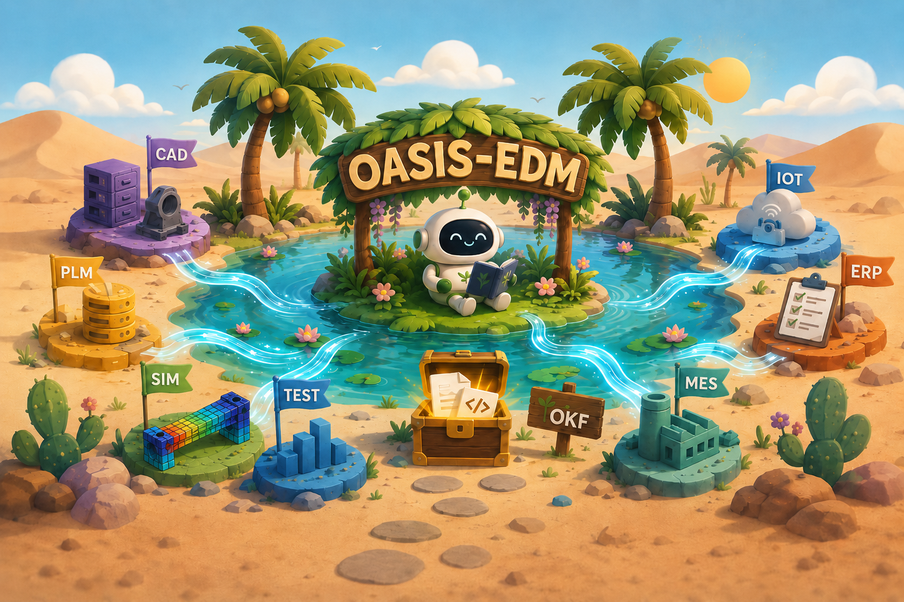

  

# Challenges in engineering data management

Engineering Data Management (EDM) means to capture, store, version, analyze and distribute all data that arise during the lifecycle of a product. For complex electro-mechanical products EDM is a very hard problem spanning many disciplines and systems: CAD models of the product might be stored in the PLM system, simulation data in SDM/SPDM, test in data in the test data management system, the BOM in the ERP system, production data in MES and operational data in an IOT database. And this list is just a tiny fraction of the real world complexity (automotive OEMs have hundreds of different systems). 

We talked a lot about the digital thread and digital twins over the last decade. Unfortunately, even the best engineering teams still do not have a holistic view on their product. Here is a list of some straight forward tasks most organizations struggle with:

- Compare test and simulation data over different product iterations 
- Use information on product usage to enable data-driven product management
- Take design decisions on manufacturability from real production data

# A new AI-native stack for engineering data management

Agentic AI promises to break the data silos and finally empower engineers to see things end-to-end again. However, results with AI assistants have been mixed so far: Give an AI assistant a folder with documents and tables and ask a complex questions and the results are nearly magical. But using agentic AI systems on top of legacy data infrastructure quickly falls off a cliff (if it is possible at all).

It is time to re-build the engineering data stack with AI-native primitives. This repo presents a new approach to EDM built on the open knowledge format (OKF) (link here). Markdown with structured frontmatter is used to describe concepts that can link to each other. Concepts can reference exernal resources (e.g. tables for structured data or native files for images, geometry) where necessary. The resulting data structure is (an) OASIS:

- **Open**: Every layer uses open formats (Markdown, Parquet, Iceberg) and proven open-source tools (Git, DuckDB). No vendor lock-in — your data stays readable and portable.
- **AI-native**: Structured frontmatter gives AI agents queryable metadata. Markdown content enables semantic search. Links between concepts form a knowledge graph. An agent can find "all crash test results for the B-pillar across 3 design iterations" in seconds — across data from different systems.
- **Simple**: An OKF concept is just a markdown file with a YAML header. You can create your first knowledge bundle with a text editor in under an hour — no new tooling, no training.
- **Interoperable**: OKF concepts link to resources in existing systems (PLM, ERP, test databases) rather than replacing them. You get a unified view without migrating a single dataset.
- **Scalable**: A single concept can reference Parquet tables with billions of rows. Concepts link to each other across teams and departments, growing into a company-wide knowledge graph.

This repos serves as an introduction and curated lists of concepts, use cases and best practices for OKF-based engineering data management.

# Why should you care and how can you contribute?

It is only day 1 for building AI in engineering. If you feel the pain of broken engineering data infrastructure yourself or are passionate about giving agency back to engineers, then please help. 

Here are some things you could do:
- Test the system in your workflows starting with a simple folder with markdowns and available tooling.
- If you have some ideas/thoughts/doubts that you want to share, please open a discussion or connect with me for a coffee talk.
- The best way for the community to get a feel for the approach are examples. If you have a dataset that is relevant for the community, please create a PR so we can list it in this repo.
- Please create a PR if you feel an important tool is missing from the list.

# How it works

## 📄 Open Knowledge Format (OKF)

The foundational primitive of the concept are markdown files that are stored in a folder structure. Each markdown file also carries a YAML-block with structured metadata information which is called [frontmatter](https://jekyllrb.com/docs/front-matter/). These text-based folder structures can be versioned an managed in existing systems such as [GIT](https://git-scm.com/).

This basic structure was popularized as [LLM-Wiki](https://gist.github.com/karpathy/442a6bf555914893e9891c11519de94f) and formalized into a minimal spec by Google under the term [Open Knowledge Format](https://github.com/google/open-knowledge-format). We won't repeat the full spec here, but only highlight the most important aspects:

1. Each markdown contains exactly one Concept
2. Concepts can link together to other concepts creating a knowledge graph
3. External data files (e.g. tables, images) can be linked to as resources

## 📊 Data lakehouse for tabular and time series data

Tabular and time series data is probably the most critical data type in engineering. Engineering teams have already started to move test-, simulation-, production data from legacy formats or databases into general purpose [Parquet](https://parquet.apache.org/) and [lakehouse](https://www.databricks.com/glossary/data-lakehouse)-based systems. Lakehouse systems overcome traditional data silos while providing cheap storage, traceability and scalability.

Both Parquet sources on file/blob/S3 storage and real lakehouse endpoints such as [Delta Lake](https://delta.io/) or [Iceberg](https://iceberg.apache.org/) can be directly referenced from the OKF markdown files as resources. 

The markdown file itself the describes the concept for each table and additional semantic information on how to use it (e.g. example queries, domain-specific information, data models as [Mermaid](https://mermaid.js.org/) diagram). It thus enhances the existing data catalogue information and provides a lightweight semantic layer.

## 📎 References to native formats (image, CAD, CAE etc.)

There are dozens of important data formats in engineering and a lot of effort has been spent to standardize many times of data (e.g. ASAM MDF, STEP 242 (correct?), JT (insert iso here)). Every existing engineering authoring tool and many analysis pipelines depend on this infrastructure. The new OKF-based EDM layer is not supposed to replace it.

Instead, existing files and repositories can simply be referenced in the markdown files. This gives an immediate benefit: The resources are indexed and can easily be found by AI-native search through similarity search or knowledge graph traversal. The OKF-description thus act as an additional analytics layer to the native operational data.

It also makes sense to extract data from source documents and enrich it to facilitate better downstream analysis. Here are some examples for typical extraction and enrichment:
- Dimensions, material properties and parametrizations of a CAD geometry
- Textual description of an image content
- Comparison of two CAE models in terms of parameters and KPIs

# Use cases including datasets

## 📏 Testing data

## 🚗 Fleet data

## 🏭 Production data

Production data encompasses everything from energy metering and machine cycle logs to quality inspection results. Today, unlocking insights from this data is slow and manual — with OASIS-EDM, it can be AI-driven.

|  | Today | Future |
|---|---|---|
| **Data access** | Siloed in MES, SCADA and historian databases; one-off Grafana dashboards per use case | Production data stored in a lakehouse, queryable across assets and time ranges |
| **Contextual knowledge** | Shift schedules, equipment master data and plant layouts scattered across PDF, Excel and tribal knowledge | All context (shift schedules, equipment specs, product recipes) stored as OKF concepts linked to the production data |
| **Time to insight** | Days — requires a data analyst to build a custom dashboard | Minutes — AI agents answer questions directly |

**Typical questions an engineer might ask:**

- Why did energy consumption spike in April compared to the previous month?
- What is the OEE breakdown across all injection molding machines — are there significant outliers?
- Generate a utilization report for Plant A, April 2025.

**Example Datasets:**

- **[Industrial Asset Level Electrical Energy Dataset](https://huggingface.co/datasets/renumics/industrial-asset-level-electrical-energy-dataset)** — 15-minute energy aggregates from 43 monitored assets in an industrial manufacturing facility in Ireland, covering ~12 months (2024-12-31 to 2025-12-31).

## 💻 Simulation data

# Frequently asked questions

## What is an engineering data analytics layer?

For business intelligence and general data analytics applications, data is not directly pulled from the transactional systems. Instead, the data is ingested into so-called online analytical processing (OLAP) databases that operate on columnar storage with heavy compression for efficient queries. An engineering data analytics layer brings this concept to EDM: A system that brings together operational data from different sources for analytical/reporting applications. 

## Do you really want to replace the existing ERP/PLM infrastructure with this?

Short answer: No. Longer answer: The current generation of enterprise data management systems are intertwined with every single enterprise process and impossible to replace. However, OASIS-EDM can work as an analytics layer on top of the legacy operational engineering data layer. In this way, OASIS enables a holistic view on engineering data without compromising existing systems. From there it is absolutely possible to shift more and more processes to OKF-compatible tools: Requirements management, bug tracking, reporting etc.

## My management loves PowerPoint too much, they will never accept markdown reports

There is a big difference between generally describing insights and facts for future use and presenting such content in a limited amount of time for a specific audience (e.g. speech, status meeting). PowerPoint is a great tool for the latter, but is heavily misused for the former.
Example: For a scientific conference you would hand in a paper written in LaTeX (general description of content) and then might do your presentation slides in PP. 
With agents, this paradigm will get even more important. You should describe all the facts and insights in markdown. Then you can push a button and get a tailored presentation (or even a video) for your stakeholders. So: You can still do PowerPoint reports, but only as a presentation output and not as a source of truth for facts and insights!

# Tools to extract, enrich, manage and analyze engineering data

## ⛏️ Tooling for data extraction and enrichment

- 📈 [Time Series Data Tools](tools/time-series-data.md) — MDF, TDMS, CAN bus signal extraction
- 🏎️ [CAX Data Tools](tools/cax-data.md) — CAD geometry, CAE simulation result processing

## 🗄️ Tooling for data storage and analysis

In this section, we exemplary list the most important tools for each category. Please consult an AI assistant of your choice to get a more extensive overview over the ecosystem.

- 🧊 [Lakehouse Formats](tools/lakehouses.md) — Iceberg, Delta Lake, DuckLake
- 🔍 [Query Engines](tools/query-engines.md) — Spark, DuckDB, StarRocks, BigQuery, Athena
- 📚 [Data Catalogues](tools/data-catalogues.md) — Unity Catalog, Polaris, Nessie
- 🏷️ [Metadata Management & Data Lineage](tools/metadata-management.md) — DataHub, OpenMetadata, Collibra, Atlan
