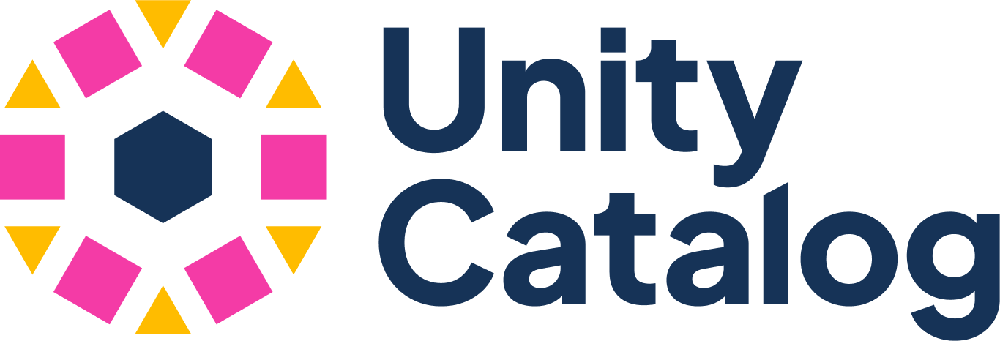
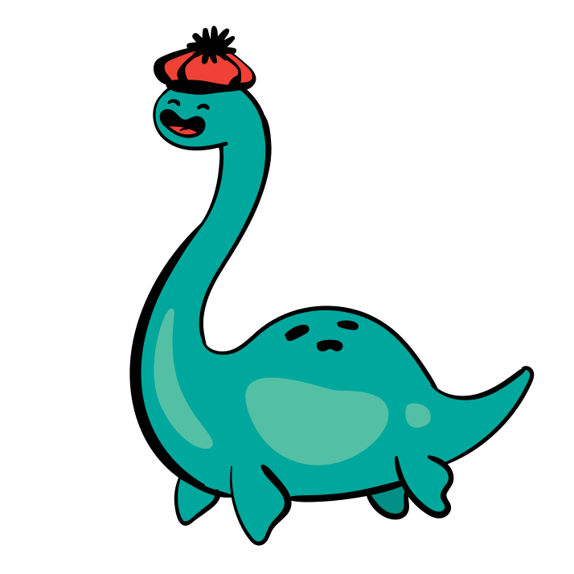

# 📚 Data Catalogues

Catalog systems that provide discovery, governance and access control for lakehouse tables — the registry that lets query engines and AI agents find the right data.

| Logo | Name | Description | License |
|------|------|-------------|---------|
|  | [Unity Catalog](https://www.unitycatalog.io/) | Open-source universal catalog for data and AI assets. Provides governance, access control and lineage across lakehouses and ML models. | Apache 2.0 |
|  | [Apache Polaris](https://polaris.apache.org/) | Open-source catalog for Apache Iceberg. Provides a REST-based catalog interface with multi-engine access, role-based access control and credential vending. | Apache 2.0 |
|  | [Project Nessie](https://projectnessie.org/) | Git-like version control for data lakes. Provides branching, tagging and commits for Iceberg tables enabling isolated experimentation and reproducibility. | Apache 2.0 |

## See also

- [Lakehouse Formats](lakehouses.md) — table formats managed by these catalogs
- [Query Engines](query-engines.md) — engines that connect through these catalogs
- [Metadata Management & Data Lineage](metadata-management.md) — platforms that build on top of catalogs
- [← Back to overview](../README.md)
