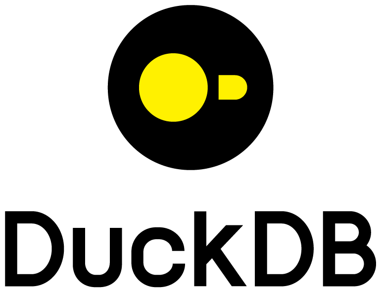
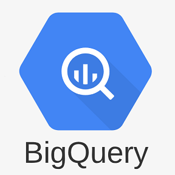

# 🔍 Query Engines

Analytical query engines that can read directly from lakehouse tables and Parquet files — enabling fast interactive analytics on engineering data without ETL.

| Logo | Name | Description | License |
|------|------|-------------|---------|
|  | [Apache Spark](https://spark.apache.org/) | Unified engine for large-scale batch and streaming data processing. Industry standard for ETL pipelines and distributed analytics on lakehouse data. | Apache 2.0 |
|  | [DuckDB](https://duckdb.org/) | In-process OLAP database with zero external dependencies. Reads Parquet, CSV, JSON and Iceberg/Delta directly. Ideal for local engineering data exploration. | MIT |
|  | [StarRocks](https://www.starrocks.io/) | High-performance MPP analytical database for real-time and batch analytics. Supports external catalogs for Iceberg and Delta Lake federation. | Apache 2.0 |
|  | [BigQuery](https://cloud.google.com/bigquery) | Google's fully managed, serverless data warehouse with built-in ML and BI. Supports Iceberg tables and external data lake connections. | Proprietary |
|  | [Amazon Athena](https://aws.amazon.com/athena/) | Serverless query service that analyzes data in S3 using SQL. Native support for Parquet, Iceberg and other open formats with pay-per-query pricing. | Proprietary |

## See also

- [Lakehouse Formats](lakehouses.md) — table formats these engines read from
- [Data Catalogues](data-catalogues.md) — catalogs that provide table discovery
- [← Back to overview](../README.md)
